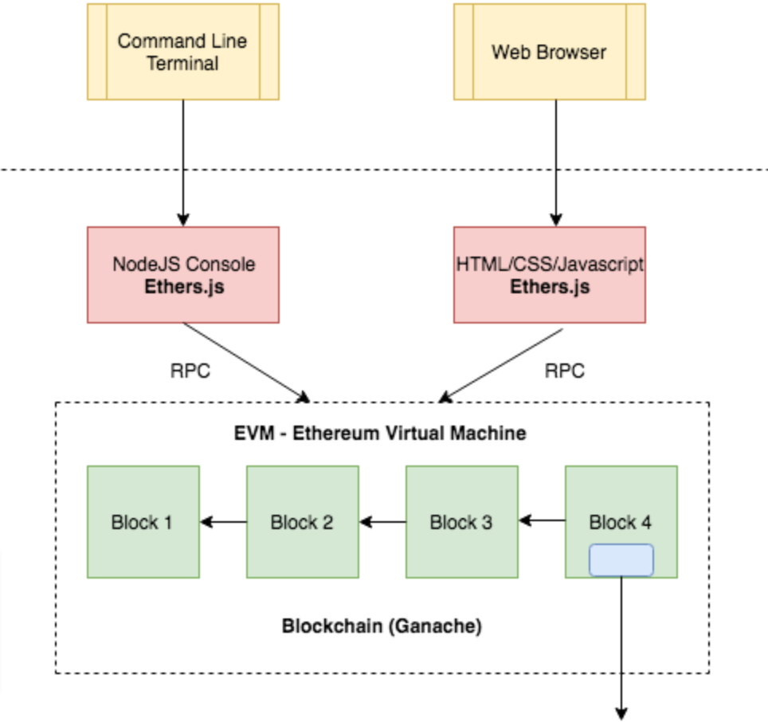

# geoRefundMobile
A mobile app for refunding employers incase employees are out of conference zone

# Business Need
 
The refund by location smart contract is aimed to be used when one party, for example an employer, agrees to pay another party, for example an employee, for being present in a certain geographic area for a certain duration. The employee’s phone sends its GPS location to a smart contract at a certain interval. Based on the pre-agreed contract codified in an Ethereum smart contract, a cryptocurrency payment is executed when all the agreed conditions are met.  
If, at any point, the GPS sensor indicates that an employee is outside the range of the agreed GPS area, the contract state will be updated to indicate that it is out of compliance.  
By the end of this project, you should produce an Ethereum based dApp that has both the smart contract tested and deployed in a testnet and a front end that will allow monitoring of the status.
